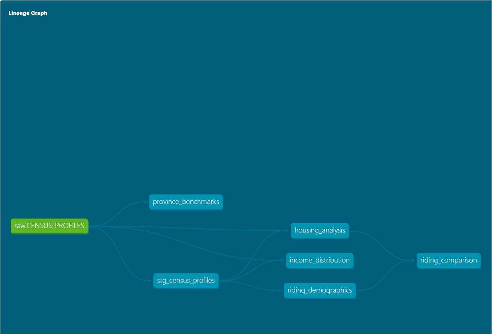
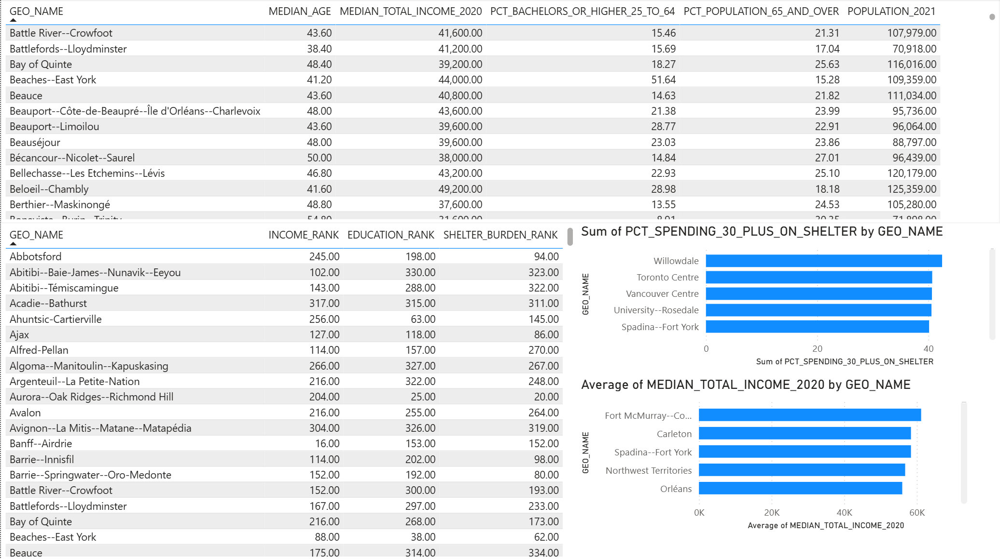

# census-analytics

dbt + Snowflake + Power BI analytics layer on Statistics Canada census data.

---

## 1. Project Overview

This project builds an ELT analytics pipeline on top of Statistics Canada 2021 Census data. It transforms raw census profiles into riding-level demographic insights using dbt and Snowflake, then visualizes the results in a Power BI dashboard designed for political and demographic analysis.

It is **Part 3 of a 3-project data engineering portfolio** (ingestion → orchestration → transformation).

---

## 2. Architecture

```
Statistics Canada 2021 Census
        ↓
PostgreSQL (Project 2 — census-pipeline)
        ↓
Python migration script (SQLAlchemy + Snowflake connector)
        ↓
Snowflake RAW schema (CENSUS_DB.RAW.CENSUS_PROFILES — 926,112 rows)
        ↓
dbt Core transformation layer (CENSUS_DB.ANALYTICS)
        ↓
Power BI Dashboard
```

---

## 3. Tech Stack

- **Python + SQLAlchemy** — one-time migration from PostgreSQL to Snowflake
- **Snowflake** — cloud data warehouse, separates compute from storage
- **dbt Core** — SQL-based transformation, testing, and documentation
- **Power BI Desktop** — dashboard connected directly to Snowflake

---

## 4. Data Source

- Statistics Canada 2021 Census profiles
- 926,112 rows covering all geographic levels: Country, Province, Territory, Federal Electoral District
- 2,631 characteristics per geography including population, income, education, housing, language
- Originally ingested in Project 2 (`census-pipeline`) via an Airflow DAG into PostgreSQL

---

## 5. dbt Models

All models materialize in `CENSUS_DB.ANALYTICS` in Snowflake. Staging models are views; mart models are tables.



- **`stg_census_profiles`** (view) — Pivots 926,112 long-format rows into 338 wide rows, one per federal electoral district. Filters to FED geo level. 55 columns covering all key characteristic IDs. Foundation for all downstream models.

- **`riding_demographics`** (table) — Primary analytical model. One row per riding with population, median age, median income, education attainment, housing tenure, and four derived percentage columns: senior share, child share, ownership rate, bachelor's rate.

- **`province_benchmarks`** (table) — One row per province using StatCan's pre-calculated provincial aggregates. Same key metrics as `riding_demographics`. Used to benchmark a riding against its provincial average.

- **`income_distribution`** (table) — Full income bracket breakdown per riding in $10k bands from under $10k to $150k+. Each bracket expressed as a percentage of income recipients. Enables income spread analysis beyond the median.

- **`housing_analysis`** (table) — Detailed housing metrics per riding: owner vs renter tenure, dwelling condition, housing suitability, shelter cost burden (30%+ threshold), and median monthly shelter costs for owned and rented dwellings.

- **`riding_comparison`** (table) — Cross-riding rankings using SQL window functions (`RANK() OVER`). Each riding receives a rank from 1–338 on income, education, dwelling value, senior population share, and shelter cost burden.

---

## 6. Dashboard

Power BI Desktop connects to Snowflake via the native Snowflake connector. Data is imported from four analytical tables.



- **Riding Demographics Table** — Sortable table of all 338 federal electoral districts showing median age, median income, bachelor's degree rate, senior population share, and total population. Primary reference view.

- **Top Ridings by Median Income** — Horizontal bar chart ranking ridings by median total income in 2020. Fort McMurray--Cold Lake leads, reflecting Alberta's resource economy.

- **Housing Affordability by Riding** — Horizontal bar chart showing percentage of households spending 30%+ of income on shelter costs. Willowdale, Toronto Centre, and Vancouver Centre top the list, reflecting Canada's high-cost urban markets.

- **Riding Rankings Table** — Cross-riding comparison showing each riding's rank on income, education, and shelter burden simultaneously. Enables multi-dimensional riding comparisons at a glance.

---

## 7. Setup Instructions

### Prerequisites

- Python 3.10+
- Docker (for PostgreSQL from Project 2)
- Snowflake account with `CENSUS_DB` configured
- dbt Core with Snowflake adapter installed
- Power BI Desktop

### Steps

1. Clone the repo.
2. Create a virtual environment and install requirements:
   ```bash
   python -m venv venv
   source venv/bin/activate   # Windows: venv\Scripts\activate
   pip install -r requirements.txt
   ```
3. Configure `.env` with PostgreSQL and Snowflake credentials.
4. Run the migration script:
   ```bash
   python migration/migrate_to_snowflake.py
   ```
5. Configure `~/.dbt/profiles.yml` with Snowflake credentials.
6. Run dbt:
   ```bash
   cd census_analytics
   dbt run
   ```
7. Run dbt tests:
   ```bash
   dbt test
   ```
8. Open `dashboard/census_analytics_dashboard.pbix` in Power BI Desktop.

---

## 8. Key Concepts Demonstrated

- ELT pattern — load raw, transform inside the warehouse using SQL
- dbt models, tests, sources, and documentation
- Data lineage — tracked automatically via `{{ ref() }}` dependencies
- Snowflake architecture — virtual warehouses, compute vs storage separation
- Long-to-wide pivot using conditional aggregation in SQL
- Window functions for cross-entity ranking (`RANK() OVER`)
- Cloud data warehouse connection to BI tooling
